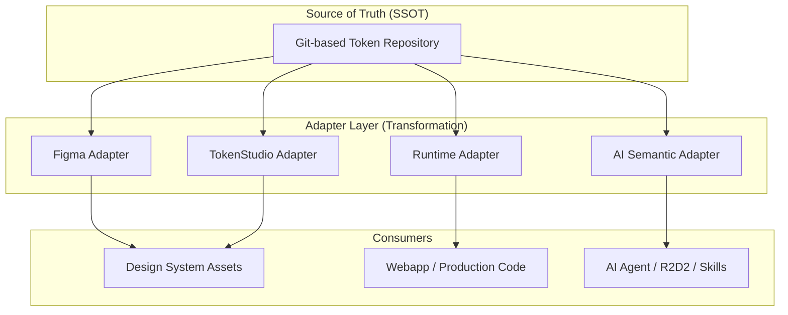

# AI-Native Design System 周汇总报告
**日期：2026年3月5日**

---

## 一、Design System 重构 & Skill 的目的与原则

### 2.1 重构目标

- **全面 AI-Native 化**：推动设计系统从底层架构到应用逻辑深度适配 AI 驱动的工作流。面向用户：设计师，开发，AI。
- **规范语义与结构**：建立严谨的 Token 命名规范与层级结构，提升机器对设计意图的理解精度。
- **定义自动化 Skills**：基于 Agent 工作流，构建涵盖 Audit、Optimize、Refactor、Sync 等核心能力的 AI Skill 体系，实现设计资产的自动化审计、优化与同步。

### 2.2 四大核心原则

- **SSOT 与单向同步**：坚持 Git 作为设计资产的单源真理（SSOT）。严禁直接编辑 Figma Token JSON，通过单向流转机制（Git -> Figma/Code）规避逻辑冲突。
- **语义化分层治理**：建立严谨的 `Primitive -> Semantic -> Alias` 命名体系。通过结构化语义提升 AI 对设计意图的理解精度。
- **自动化适配优先**：构建转换层实现多端适配，通过插件化适配器降低 AI Skill 接入成本。
- **效率优先与工具协同**：在优化的同时，最大化匹配各个角色使用工具的效率，而不是硬性规范。

---

## 二、进度与 Roadmap

> 采用双轴并行开发模式，目前正处于 **AI-Native 语义化治理** 与 **Skill 测试迭代** 的关键同步节点。

### 2.1 轴 1：AI-Native DS 重构
- ✅ **1. Token 命名结构治理** (已完成)
- ⚡ **2. AI NATIVE 语义治理** (进行中)
- ⏳ **3. 修改或扩充当前 Token 值** (待启动)
- ⏳ **4. 应用到 Source JSON & Figma** (待启动)

### 2.2 轴 2：可复用 Skills 开发
- ✅ **1. Audit 和优化 Skill** (已完成)
- ✅ **2. Refactor 和 Code Sync Skill** (已完成) *(注: 此节点至下一节点之间存在较高的难度进度要求)*
- ✅ **3. 合并成一个 Skill 和对应脚本/模板修改** (已完成)
- ⚡ **4. 测试和迭代** (进行中)
- ⏳ **5. 内部测试** (待启动)

---

## 三、核心节点、产出与卡点

### 3.1 已完成的核心节点和产出

- **SSOT 与自动化架构确立**：建立了基于 Git 管理的单源真理（SSOT）架构，实现了从设计源头到交付端的自动化同步流程，确保了 Token 资产的一致性与可追溯性。
- **Webapp DS Token 语义化重构**：基于现有 Webapp 设计系统完成了 Token 的语义化定义与重构，建立了符合 AI 理解逻辑的命名规范，为后续自动化生成与校验奠定了基础。
- **多场景 Adapter 规则定义**：完成了针对 Figma、TokenStudio、Runtime 及 AI 语义化场景的适配器规则制定，通过统一的 Source Token 结构兼容不同平台的消费需求。
- **低门槛 Skill 适配方案**：开发了插件化（Plug-in）适配器，通过优化 Skill 调用逻辑，成功规避了对付费计划及额外 API 操作的依赖，显著降低了 AI 工具链的接入成本。
  - 🔗 第一版 Skill 开发完成（将继续 revamp 更新）：[Design System Governance Workflow](https://skills.sh/j7supreme/design-system-skills/design-system-governance-workflow)

### 3.2 当前卡点 & 风险

- **Skill 能力重叠与定位重塑**：在 WK1 完成 Audit 与 Optimizer 开发后，发现其功能与 R2D2 原生审计能力存在重叠。团队随即回撤并重新审视了两者在决策原则与能力边界上的差异，完成了原则融合、R2D2 局限性定位及 Skill 差异化功能定义。
- **迭代节奏受定位调整影响**：由于需对 Skill 进行重新设计以确保其独特价值，WK2 投入了额外时间进行重构与更新。目前已完成能力对齐，正处于测试迭代阶段。

---

## 四、AI-Native DS 核心架构与流程

### 4.1 整体架构图

### 4.2 核心工作流

> 此处待补充：说明从 Token 定义 → 生成 → 同步 → 应用的完整流程

### 4.3 技术栈 & 关键组件：Token 语义四层结构

1. **Primitive Layer (基础层)**：定义最基础的原子值（颜色、间距、圆角等 scale），不包含业务语义，是系统的视觉比例尺。
2. **Semantic Layer (语义层)**：核心 AI 理解层，遵循 **category.role.state** 命名。将基础值映射到设计意图，支持跨场景推理。
3. **Pattern Layer (模式层)**：抽象通用的 UI 模式（如 Surface、Layout），定义更高维度的交互样式规则。
4. **Component Layer (组件层)**：组件级的实例化决策。组合语义与模式，用于 Runtime 与 AI 系统重建具体组件。

### 4.4 AI Token 消费流与一致性约束

- **AI 生图链路 (Generation Flow)**：`User Prompt` -> `AI Reasoning (意图与语义解析)` -> `Component Resolution (解析组件层)` -> `Token Lookup (检索 Semantic/Pattern)` -> `Generate UI (按需调用代码或设计模型)`。
- **AI 重组组件 (Resolution)**：AI 通过 Token 层级重建组件。例如读取 `component.button.primary` 时，会自动拆解并映射至对应的 Semantic 色彩、标准文本样式和 Primitive 比例尺。
- **强一致性设计约束**：AI 生成 UI 必须严格匹配设计规范，禁止创造未知视觉偏差。禁止硬编码颜色（如 `#007FFF`），禁止魔法数字（通过 Scale 指定，如使用 `spacing.8` 而不是 `7px`），并要求对预定义资产的绝对映射。

---

## 五、原因 & 决策背景

- **Figma MCP 与 API 限制**：目前 Figma MCP 存在局限性，`get variable` 无法获取全局 Variable Token 定义，仅能获取页面内 Node 应用的变量；若通过 REST API 获取则需 Enterprise 计划，从能力化构建角度考量成本效益较低。
  - > *补充信息：Figma 官方文档说明了通过 REST API 直接写入变量（`file_variables:write` 这个高级权限）是 Figma Enterprise（企业版）的专属特权。因为账号是个人免费版或 Pro 版，所以无法获取该权限。*
- **Token Schema 差异与兼容性**：Figma 原生 Schema 较为保守（如不支持 Gradient 等复杂属性），而 TokenStudio 等插件的完整 Schema 虽然强大但需要 Pro 计划。这些格式与四层语义结构及审计规范存在一定差异，因此决定采用 SSOT 结构，并在应用层进行转换（Adapter Layer）。

---

## 六、Demo 演示

### 6.1 Demo 概述

> 简要描述 Demo 的目标和覆盖范围

### 6.2 Demo 内容

> 列出 Demo 中展示的功能点和流程

### 6.3 Demo 链接 & 资源

> 相关链接、截图或视频

---

*— End of Report —*
